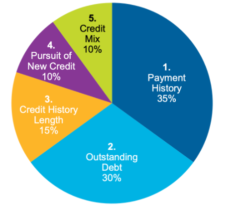

 
 
 - Payment History
	 - Paying off your balance in full is the most important way to improve your credit score!
	 - Avoid spending over 30% of your credit limit every month
- Outstanding Debt
	- If you have a balance on your card, try to pay it off as soon as possible
	- Avoid borrowing more than you can pay off
- Credit History Length
	- The longer your history, the better your score
- Pursuit of New Credit
	- ADD ME